# MASM 概要设计说明书

> 零代码多 Agent 拖拽式工作流设计平台（低代码 Agent 开发系统）
>
> 版本：v0.1.0 | 日期：2026-06-26 | 状态：MVP

---

## 文档修订记录

| 版本 | 日期 | 修订人 | 修订说明 |
|------|------|--------|---------|
| 0.1.0 | 2026-06-26 | — | 初稿，基于初步设计.md 编写，覆盖 MVP 全部范围 |

---

# 1. 引言

## 1.1 编写目的

本文档是 MASM（Multi-Agent System Maker）系统的**概要设计说明书**，依据《初步设计.md》中定义的功能需求与非功能需求，对系统进行结构化的高层设计。文档面向以下读者：

- **开发团队**：理解模块划分、接口契约、数据流与关键算法，作为详细设计与编码的输入
- **测试团队**：理解系统运行路径与异常处理策略，作为集成测试用例设计的依据
- **架构评审人员**：评估系统架构的合理性、可扩展性与安全性

## 1.2 设计范围

本文档覆盖 MVP 阶段全部需求，包括：

- 可视化画布编辑器（6 类节点、拖拽连线、拓扑校验、蓝图管理）
- 工作流运行引擎（DAG 解析、分层调度、串行/分支/并行执行、120s 超时）
- Prompt 自动生成引擎（模板匹配 + AI 生成双模式）
- 主 Agent 工作流分析服务（智能生成各 Agent 节点任务描述）
- API Key 管理（Fernet 加密、临时文件存储、页面内可视化配置）

## 1.3 术语定义

| 术语 | 英文 | 定义 |
|------|------|------|
| 蓝图 | Blueprint | 用户在画布上构建的工作流完整描述，包含节点集合与连线集合 |
| DAG | Directed Acyclic Graph | 有向无环图，工作流的底层数据结构，禁止循环闭环 |
| 拓扑排序 | Topological Sort | 基于 Kahn BFS 算法对 DAG 节点进行线性排序，生成执行顺序 |
| Agent 节点 | Agent Node | 核心业务节点，接收上游 JSON 报文，调用 LLM 执行任务并输出结构化数据 |
| 条件分支 | Condition Node | 逻辑控制节点，由 LLM 根据自然语言规则判断 pass/reject 分流 |
| 并行分支 | Parallel Node | 将同一份输入同时分发至 ≥2 条子链路，子链路通过 Promise.all 并发执行 |
| 数据汇总 | Merge Node | 收集 ≥2 条并行链路的结构化输出，纯 JSON 拼接后统一向下游传递 |
| 主 Agent | Master Agent | 独立于工作流之外的顶层 AI，负责分析工作流 DAG 结构并为各 Agent 节点智能生成 taskDescription |
| NodeMessage | — | 节点间传递的标准化 JSON 报文，包含 sourceNodeId/rawContent/structuredData/timestamp |
| 悬挂节点 | Dangling Node | 未处于从开始节点到结束节点连通路径中的孤立节点 |
| SPA | Single Page Application | 单页应用，所有页面切换在浏览器端完成，无需整页刷新 |
| HMR | Hot Module Replacement | 热模块替换，Vite 开发服务器提供的实时模块更新能力 |
| AbortController | — | Web API，用于通过 signal 中断正在进行的 fetch 请求 |
| Fernet | — | Python cryptography 库中的对称加密方案（AES-128-CBC + HMAC-SHA256） |
| Kahn 算法 | Kahn's Algorithm | 基于 BFS 的拓扑排序算法，通过逐步移除入度为 0 的节点生成排序结果 |
| DFS | Depth-First Search | 深度优先搜索，本文档中用于环路检测的三色染色法 |
| BFS | Breadth-First Search | 广度优先搜索，用于连通性校验和分层生成 |
| DAG | Directed Acyclic Graph | 有向无环图，保证执行路径不含循环 |
| Zustand | — | 轻量级 React 状态管理库，基于发布/订阅模式 |
| LocalStorage | — | 浏览器提供的键值对持久化存储 API，容量通常为 5-10MB |

## 1.4 参考资料

- 《初步设计.md》— MASM 项目需求规格与设计决策文档
- 《README.md》— 项目结构、技术栈与使用说明
- IEEE 1016-2009 — 软件设计描述标准
- GB/T 8567-2006 — 计算机软件文档编制规范

---

# 2. 系统总体设计

## 2.1 系统分解

系统采用**前后端分离**架构。前端负责可视化编辑与工作流引擎编排，后端仅作为大模型 API 的安全代理网关与智能服务层。

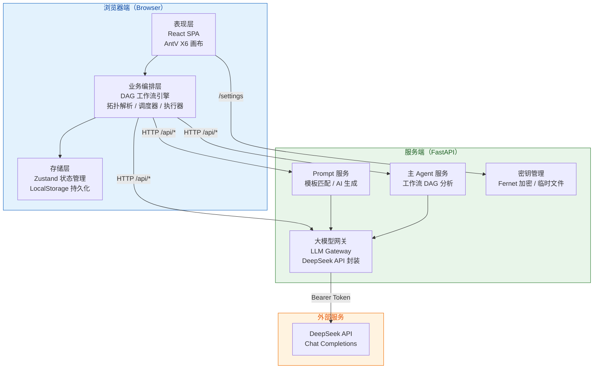

## 2.2 各层职责

### 2.2.1 表现层（前端 — React SPA）

| 组件 | 职责 |
|------|------|
| BlueprintListPage | 蓝图列表展示，新建/删除/进入编辑，执行历史入口 |
| EditorPage | 画布编辑器主容器，左侧节点面板拖拽 + 画布区域 + 右侧配置抽屉 |
| CanvasEditor | AntV X6 Graph 封装，自定义 3 种 SVG 节点形状，连线交互，键盘快捷键 |
| NodeConfigDrawer | 节点配置抽屉，Agent 任务描述 / 分支规则输入，失焦自动保存 |
| ExecutePage | 流程运行页，输入初始文本 → 逐节点可视化（高亮 + IO 卡片） |
| LogDetailPage | 执行日志详情，全局摘要 + 分节点 IO 展开 |
| SettingsPage | LLM 供应商选择 + API Key 配置 / 状态检测 / 清除 |

### 2.2.2 业务编排层（前端引擎模块）

| 模块 | 文件 | 职责 |
|------|------|------|
| 核心类型 | `engine/types.ts` | 8 个核心 TypeScript 接口，与设计文档第五节数据模型一致 |
| 拓扑解析器 | `engine/topology.ts` | DAG 环路检测（DFS 三色染色）、Kahn 拓扑排序、节点出入度约束校验、连通性校验 |
| 调度器 | `engine/scheduler.ts` | 分层调度、并行 Promise.all 分发、条件分支路径选择、120s 全局超时、异常即停 |
| 执行器 | `engine/executor.ts` | 6 种节点类型执行逻辑、AbortController 超时中断、LLM 调用结果 JSON 解析 |

### 2.2.3 智能服务层（后端 — FastAPI）

| 模块 | 文件 | 职责 |
|------|------|------|
| LLM 网关 | `services/llm_gateway.py` | 统一封装 DeepSeek API，提供 `call_llm()` 异步方法，支持超时与错误处理 |
| Prompt 服务 | `services/prompt_service.py` | 关键词表匹配 4 类模板 → 填充；无匹配时调用 LLM 自动生成 |
| 主 Agent 服务 | `services/workflow_service.py` | 接收蓝图 JSON，构建 DAG 文本描述，调用 LLM 分析并返回各 Agent 节点 taskDescription |
| 密钥管理 | `services/key_manager.py` | Fernet 对称加密 API Key，写入/读取/清除临时文件 |
| 路由层 | `api/routes/*.py` | RESTful 路由注册与请求/响应模型校验 |

### 2.2.4 基础设施层

| 组件 | 说明 |
|------|------|
| 浏览器 LocalStorage | 蓝图 JSON 序列化存储、执行日志持久化 |
| 服务端临时文件 | 加密后的 API Key 存储（`backend/.key_store.enc`），重启自动丢失 |
| DeepSeek API | 第三方 LLM 服务，通过 Bearer Token 认证 |

## 2.3 技术选型与理由

| 层面 | 选型 | 选型理由 |
|------|------|---------|
| 前端框架 | React 18 + TypeScript | 生态成熟，类型安全，与 AntV X6 React 集成友好 |
| 可视化画布 | AntV X6 v2 | 蚂蚁开源，内置 DAG 支持，自定义 SVG 节点，社区活跃 |
| 状态管理 | Zustand | 轻量（< 1KB），无 boilerplate，支持 selectors 精准渲染 |
| 路由 | React Router v7 | SPA 标准方案，支持动态参数与嵌套路由 |
| 构建 | Vite 6 | 极速 HMR，ESBuild 预打包，原生 TS/JSX 支持 |
| 后端框架 | FastAPI | 原生 async/await，自动 OpenAPI 文档，Pydantic 校验 |
| LLM 厂商 | DeepSeek | 高性价比，兼容 OpenAI 协议，中文理解能力强 |
| 加密 | cryptography (Fernet) | Python 标准加密库，对称加密简单可靠 |
| 存储 | LocalStorage | MVP 无需后端数据库，满足纯浏览器端数据持久化 |

## 2.4 关键设计决策

| 决策 | 内容 | 理由 |
|------|------|------|
| 工作流引擎前端化 | 拓扑解析、调度、执行全部在前端完成 | 减少网络往返，实时可视化响应更快；MVP 无需后端工作流状态管理 |
| 后端仅做 API 代理 | 所有 LLM 调用经后端转发，前端不持有 Key | 安全隔离，Key 不暴露于浏览器端 |
| 单轮 LLM 调用 | Agent 节点仅一次 LLM 交互，无自反思循环 | MVP 简化，控制延迟与成本，预留开关后续开启 |
| 汇总节点纯 JSON 拼接 | 不额外调用 AI 合并 | MVP 阶段减少 LLM 调用次数，降低时延与费用 |
| AbortController 超时 | 单节点超时通过 AbortController.signal 中断 fetch | 避免 HTTP 请求悬空，真正释放资源 |
| 嵌套汇总暂不支持 | executeBranch 中 merge 节点跳过处理 | MVP 优先保证单层并行+汇总正确性，复杂拓扑后续迭代 |

# 3. 模块结构设计

## 3.1 前端模块结构

### 3.1.1 前端包图

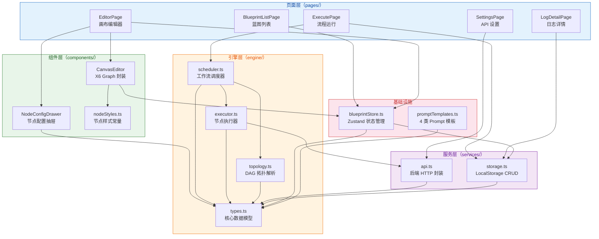

### 3.1.2 页面层详细说明

#### BlueprintListPage (`/`)

| 属性 | 说明 |
|------|------|
| 依赖模块 | `blueprintStore`（列表读取）、`storage`（删除/日志加载） |
| 路由 | `/` |
| 用户交互 | 点击「新建蓝图」→ 新建空白蓝图并跳转编辑页；点击「编辑」→ 跳转对应蓝图编辑页；点击「运行」→ 跳转执行页；点击「删除」→ 从 LocalStorage 移除 |
| 状态 | `list: WorkflowBlueprint[]`、`logs: ExecutionLog[]`（最近 10 条） |

#### EditorPage (`/editor/:id`)

| 属性 | 说明 |
|------|------|
| 依赖模块 | `CanvasEditor`、`NodeConfigDrawer`、`blueprintStore`、`api` |
| 路由 | `/editor/:id` |
| 用户交互 | 左侧面板拖拽 6 种节点到画布；鼠标连线；点击节点 → 右侧抽屉配置；工具栏「保存」「运行」「智能生成」；Ctrl+Z 撤销、Delete 删除 |
| 状态 | `aiGenerating`、`aiMsg`（智能生成状态与提示） |

#### ExecutePage (`/execute/:id`)

| 属性 | 说明 |
|------|------|
| 依赖模块 | `scheduler`（runWorkflow）、`topology`（validateTopology）、`storage`（saveLog） |
| 路由 | `/execute/:id` |
| 用户交互 | 输入初始文本 → 点击「开始运行」→ 逐节点渲染 IO 卡片（实时高亮当前节点）→ 完成后可查看日志 |
| 状态 | `userInput`、`activeNodeId`、`nodeRecords[]`、`flowLog` |

#### LogDetailPage (`/logs/:logId`)

| 属性 | 说明 |
|------|------|
| 依赖模块 | `storage`（getLog） |
| 路由 | `/logs/:logId` |
| 用户交互 | 全局摘要（成功/失败/超时、总耗时、节点数）→ 分节点展开（入参、Prompt、原始返回、结构化输出、耗时） |

#### SettingsPage (`/settings`)

| 属性 | 说明 |
|------|------|
| 依赖模块 | `api`（setApiKey / checkApiKey / deleteApiKey） |
| 路由 | `/settings` |
| 用户交互 | 选择 LLM 供应商 → 输入 API Key → 保存 / 清除；Key 状态实时检测显示 |

### 3.1.3 引擎层详细说明

#### types.ts — 核心数据模型

定义全部 8 个 TypeScript 接口，与设计文档第五节一一对应：

| 接口 | 用途 |
|------|------|
| `NodeType` | 联合类型 `"start" \| "agent" \| "condition" \| "parallel" \| "merge" \| "end"` |
| `WorkflowBlueprint` | 蓝图顶层结构，包含 id/name/nodes/edges/createTime |
| `WorkflowNode` | 节点实体，包含 nodeId/nodeType/config/position |
| `NodeConfig` | 节点配置，taskDescription（Agent） / branchRule（Condition） / templateId |
| `WorkflowEdge` | 连线实体，sourceNodeId/targetNodeId/label/branchIndex |
| `NodeMessage` | 节点间传递的标准化 JSON 报文 |
| `ExecutionLog` | 单次执行全局日志 |
| `NodeRecord` | 单节点执行记录 |

#### topology.ts — DAG 拓扑解析器

| 函数 | 输入 | 输出 | 说明 |
|------|------|------|------|
| `parseTopology(bp)` | `WorkflowBlueprint` | `TopologyResult` | 完整解析：构建邻接表 → 开始/结束节点校验 → DFS 环路检测 → BFS 连通性校验 → Kahn 拓扑排序 → BFS 分层 |
| `validateTopology(bp)` | `WorkflowBlueprint` | `string[]` | 拓扑约束校验（6 种节点出入度规则 + 环路 + 连通性），返回错误消息数组，空数组表示通过 |

#### scheduler.ts — 工作流调度器

| 函数 | 输入 | 输出 | 说明 |
|------|------|------|------|
| `runWorkflow(bp, userInput, options)` | 蓝图 + 用户输入 + 回调钩子 | `Promise<ExecutionLog>` | 主调度入口：解析拓扑 → 按层执行 → 并行/分支/汇总分发 → 120s 超时 → 异常即停 → 返回完整日志 |
| `executeBranch(...)` | 起始节点 + 拓扑 + 共享状态 | `Promise<void>` | 递归执行分支路径，BFS 遍历，支持嵌套并行与条件分支 |

#### executor.ts — 节点执行器

| 函数 | 说明 |
|------|------|
| `executeNode(node, input, timeoutMs)` | 按 nodeType 分发至对应执行函数，创建 AbortController 超时控制，返回 NodeRecord |
| `recordToMessage(record, nodeId)` | 将 NodeRecord 的 structuredOutput 包装为 NodeMessage |
| `executeStart()` | 透传用户输入为结构化 JSON |
| `executeAgent()` | 请求 Prompt 服务 → 调用 LLM → 尝试解析 JSON 输出 |
| `executeCondition()` | 构造判断 Prompt → 调用 LLM → 返回 pass/reject |
| `executeParallel()` | 透传上游数据（分发逻辑在 scheduler 中） |
| `executeMerge()` | 纯 JSON 数组拼接（输入已由 scheduler 预组装） |
| `executeEnd()` | 透传最终结果 |

## 3.2 后端模块结构

### 3.2.1 后端包图

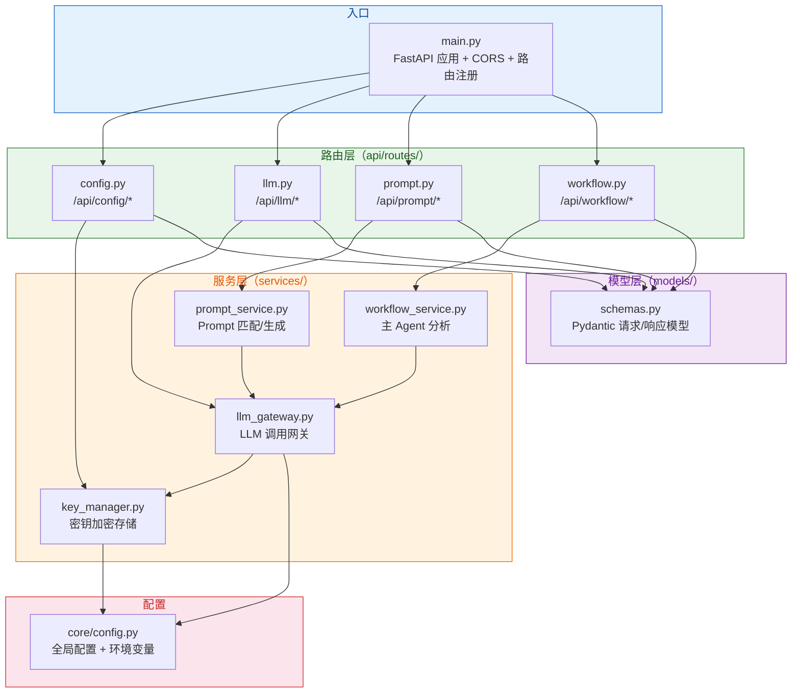

### 3.2.2 路由层详细说明

| 路由文件 | 前缀 | 端点 | 方法 | 说明 |
|---------|------|------|------|------|
| config.py | `/api/config` | `/key` | POST | 设置 API Key |
| | | `/key` | GET | 检查 Key 是否已配置 |
| | | `/key` | DELETE | 清除 Key |
| llm.py | `/api/llm` | `/chat` | POST | 调用大模型对话 |
| prompt.py | `/api/prompt` | `/generate` | POST | 生成结构化 Prompt |
| workflow.py | `/api/workflow` | `/analyze` | POST | 主 Agent 分析工作流 |

### 3.2.3 服务层详细说明

#### llm_gateway.py — LLM 调用网关

| 函数 | 说明 |
|------|------|
| `call_llm(messages, temperature, max_tokens)` | 通过 httpx 异步调用 DeepSeek Chat Completion，自动附加 Bearer Token，60s 超时 |

#### prompt_service.py — Prompt 生成服务

| 函数 | 说明 |
|------|------|
| `match_template(task_description)` | 关键词表 + 正则匹配，返回场景标签或 None |
| `fill_template(task_description, scene)` | 根据场景填充对应模板，返回 system_prompt/user_prompt/output_schema |
| `auto_generate_prompt(task_description)` | 调用 LLM 自动生成 Prompt（角色设定 + 任务指令 + 输出格式约束） |

#### workflow_service.py — 主 Agent 分析服务

| 函数 | 说明 |
|------|------|
| `analyze_workflow(blueprint)` | 构建 DAG 文本描述 → 调用 LLM 分析 → 返回各 Agent 节点的 taskDescription + 流程综述 |

#### key_manager.py — 密钥管理

| 函数 | 说明 |
|------|------|
| `save_api_key(api_key)` | Fernet 加密后写入 KEY_FILE_PATH |
| `load_api_key()` | 读取并解密，返回 str 或 None |
| `is_key_configured()` | 布尔查询 |
| `clear_api_key()` | 删除临时文件 |

---

# 4. 接口设计

## 4.1 REST API 契约

### 4.1.1 健康检查
GET /api/health

**响应 200：**
```json
{
  "status": "ok",
  "env": "development"
}
```

### 4.1.2 API Key 管理

#### 设置 Key
POST /api/config/key

| 属性 | 类型 | 必填 | 说明 |
|------|------|------|------|
| api_key | string | 是 | DeepSeek API Key（sk-...） |

**响应 200：**
```json
{
  "success": true,
  "message": "API Key 已保存，重启服务后需重新设置",
  "data": null
}
```

#### 检查 Key 状态
GET /api/config/key

**响应 200：**
```json
{
  "configured": true,
  "message": "API Key 已配置"
}
```

#### 清除 Key
DELETE /api/config/key

**响应 200：**
```json
{
  "success": true,
  "message": "API Key 已清除",
  "data": null
}
```

### 4.1.3 LLM 对话
POST /api/llm/chat

| 属性 | 类型 | 必填 | 默认值 | 说明 |
|------|------|------|--------|------|
| messages | Array\<{role: string, content: string}\> | 是 | — | 符合 OpenAI Chat 格式的消息列表 |
| temperature | float | 否 | 0.7 | 采样温度，范围 [0, 2.0] |
| max_tokens | int | 否 | 4096 | 最大输出 token 数，范围 [1, 32768] |

**响应 200：**
```json
{
  "content": "模型返回的文本内容",
  "model": "deepseek-chat",
  "usage": {
    "prompt_tokens": 150,
    "completion_tokens": 300,
    "total_tokens": 450
  }
}
```

**错误响应：**

| 状态码 | detail | 触发条件 |
|--------|--------|---------|
| 400 | API Key 未配置，请先通过 POST /api/config/key 设置 | `call_llm` 中 `load_api_key()` 返回 None |
| 502 | LLM 调用失败: {详情} | httpx 请求异常或 API 返回非 200 |

**错误响应示例（400）：**
```json
{
  "detail": "API Key 未配置，请先通过 POST /api/config/key 设置"
}
```
**错误响应示例（502）：**
```json
{
  "detail": "LLM 调用失败: timeout after 60s"
}
```

### 4.1.4 Prompt 生成
POST /api/prompt/generate

| 属性 | 类型 | 必填 | 默认值 | 说明 |
|------|------|------|--------|------|
| task_description | string | 是 | — | 用户填写的自然语言任务描述 |
| force_template | string | 否 | null | 强制指定模板 ID（"template_copywriting" 等） |

**响应 200：**
```json
{
  "system_prompt": "你是一位资深的文案撰写专家...",
  "user_prompt": "请根据以下任务描述，撰写高质量文案：\n{task}\n...",
  "template_id": "template_copywriting",
  "output_schema": {
    "title": "string",
    "content": "string",
    "keywords": ["string"]
  }
}
```

其中 `template_id` 为 `null` 时表示未命中模板，由 AI 自动生成。

**错误响应：**

| 状态码 | detail | 触发条件 |
|--------|--------|---------|
| 400 | 未找到模板: {id} | force_template 指定的模板不存在 |
| 502 | Prompt 自动生成失败: {详情} | AI 生成过程中 LLM 调用异常 |

**错误响应示例（400）：**
```json
{
  "detail": "未找到模板: template_unknown"
}
```
**错误响应示例（502）：**
```json
{
  "detail": "Prompt 自动生成失败: LLM returned invalid JSON"
}
```

### 4.1.5 主 Agent 工作流分析
POST /api/workflow/analyze

| 属性 | 类型 | 必填 | 说明 |
|------|------|------|------|
| id | string | 是 | 蓝图唯一标识 |
| name | string | 否 | 蓝图名称，默认"未命名工作流" |
| nodes | Array\<Node\> | 是 | 节点列表（含 nodeType/config/position） |
| edges | Array\<Edge\> | 是 | 连线列表（含 sourceNodeId/targetNodeId/label） |
| createTime | int | 否 | 蓝图创建时间戳 |

**响应 200：**
```json
{
  "node_configs": [
    {
      "nodeId": "node_1750123456789_1",
      "taskDescription": "你是一位专业内容审核员，请接收上游的文案内容..."
    },
    {
      "nodeId": "node_1750123456790_2",
      "taskDescription": "作为内容优化师，请根据审核结果修改文案..."
    }
  ],
  "summary": "这是一个文案审核->优化->发布的串行工作流"
}
```

**错误响应：**

| 状态码 | detail | 触发条件 |
|--------|--------|---------|
| 400 | API Key 未配置 | 后端无法调用 LLM |
| 502 | 工作流分析失败: {详情} | LLM 返回无法解析的 JSON |

**错误响应示例（400）：**
```json
{
  "detail": "API Key 未配置，请先通过 POST /api/config/key 设置"
}
```
**错误响应示例（502）：**
```json
{
  "detail": "工作流分析失败: failed to parse LLM response"
}
```

## 4.2 节点间数据报文格式

所有节点之间传递的数据统一为固定 Schema 的 `NodeMessage`：

```typescript
interface NodeMessage {
  sourceNodeId: string;            // 发送方节点唯一 ID
  rawContent: string;              // 原始文本内容
  structuredData: Record<string, unknown>;  // 结构化 JSON 数据
  timestamp: number;               // Unix 毫秒时间戳
}
```

**示例（Agent 节点输出）：**
```json
{
  "sourceNodeId": "node_1750123456789_1",
  "rawContent": "审核结果：该文案包含敏感词...",
  "structuredData": {
    "is_compliant": false,
    "issues": ["包含违禁词A", "缺少免责声明"],
    "suggestion": "建议修改第二段..."
  },
  "timestamp": 1750123500000
}
```

## 4.3 前端服务 API 封装

前端 `services/api.ts` 封装了全部后端接口调用，统一使用 `fetch` + `Content-Type: application/json`。

| 方法 | 对应接口 | 额外参数 |
|------|---------|---------|
| `api.setApiKey(key)` | POST /api/config/key | — |
| `api.checkApiKey()` | GET /api/config/key | — |
| `api.deleteApiKey()` | DELETE /api/config/key | — |
| `api.chat(messages, temp, maxTokens, signal)` | POST /api/llm/chat | `signal?: AbortSignal` 用于超时中断 |
| `api.generatePrompt(taskDesc, forceTemplate, signal)` | POST /api/prompt/generate | `signal?: AbortSignal` |
| `api.analyzeWorkflow(blueprint)` | POST /api/workflow/analyze | — |
| `api.health()` | GET /api/health | — |

## 4.4 前端存储接口

前端 `services/storage.ts` 封装了 LocalStorage 的 CRUD 操作：

| 函数 | 说明 | 存储 Key |
|------|------|---------|
| `loadBlueprints()` | 加载全部蓝图 | `masm_blueprints` |
| `saveBlueprint(bp)` | 保存/更新单蓝图 | `masm_blueprints` |
| `deleteBlueprint(id)` | 删除单蓝图 | `masm_blueprints` |
| `getBlueprint(id)` | 按 ID 查找蓝图 | `masm_blueprints` |
| `loadLogs()` | 加载全部日志 | `masm_logs` |
| `saveLog(log)` | 保存日志（unshift 到列表头部） | `masm_logs` |
| `getLog(logId)` | 按 logId 查找日志 | `masm_logs` |

# 5. 数据设计

## 5.1 数据存储分布

| 存储位置 | 数据类型 | 格式 | 键/文件名 | 生命周期 |
|---------|---------|------|----------|---------|
| 浏览器 LocalStorage | 蓝图列表 | JSON 数组 | `masm_blueprints` | 用户手动清除或浏览器清除 |
| 浏览器 LocalStorage | 执行日志列表 | JSON 数组 | `masm_logs` | 用户手动清除或浏览器清除 |
| 服务端临时文件 | 加密 API Key | Fernet 密文 | `KEY_FILE_PATH` | 服务重启自动丢失 |
| 内存（Zustand Store） | 当前编辑蓝图 | TypeScript 对象 | — | 页面会话期间 |
| 内存（Zustand Store） | 撤销栈快照 | JSON 字符串数组 | — | 页面会话期间（上限 50） |

## 5.2 蓝图 JSON Schema（LocalStorage 存储格式）

### 5.2.1 顶层结构 WorkflowBlueprint

```typescript
{
  "id": "bp_1750123456789",         // string，蓝图唯一标识，格式 bp_{timestamp}
  "name": "文案审核工作流",          // string，用户命名
  "createTime": 1750123456789,       // number，Unix 毫秒时间戳
  "nodes": [ ... ],                  // WorkflowNode[]
  "edges": [ ... ]                   // WorkflowEdge[]
}
```

### 5.2.2 节点实体 WorkflowNode

```typescript
{
  "nodeId": "node_1750123456789_1",  // string，全局唯一，格式 node_{timestamp}_{counter}
  "nodeType": "agent",               // "start" | "agent" | "condition" | "parallel" | "merge" | "end"
  "position": { "x": 320, "y": 200 }, // 画布像素坐标
  "config": {
    "taskDescription": "请审核文案合规性并给出修改建议",  // string，Agent 节点专用
    "branchRule": "判断内容是否包含敏感词",              // string，条件分支节点专用
    "templateId": "template_review"                      // string|null，匹配到的 Prompt 模板 ID
  }
}
```

### 5.2.3 连线实体 WorkflowEdge

```typescript
{
  "edgeId": "edge_1750123456789_2",  // string，全局唯一，格式 edge_{timestamp}_{counter}
  "sourceNodeId": "node_..._1",      // string，源节点 ID
  "targetNodeId": "node_..._3",      // string，目标节点 ID
  "label": "pass",                   // string?，分支标识，用于条件分支节点出口标记
  "branchIndex": 0                   // number?，分支数字索引，与 label 二选一使用
}
```

### 5.2.4 完整示例（串行：开始 → Agent → 结束）

```json
{
  "id": "bp_1750123500000",
  "name": "简单客服工作流",
  "createTime": 1750123500000,
  "nodes": [
    {
      "nodeId": "node_1750123500001_1",
      "nodeType": "start",
      "position": { "x": 150, "y": 200 },
      "config": {}
    },
    {
      "nodeId": "node_1750123500001_2",
      "nodeType": "agent",
      "position": { "x": 350, "y": 200 },
      "config": {
        "taskDescription": "回答客户的咨询问题，保持专业和友好"
      }
    },
    {
      "nodeId": "node_1750123500001_3",
      "nodeType": "end",
      "position": { "x": 550, "y": 200 },
      "config": {}
    }
  ],
  "edges": [
    {
      "edgeId": "edge_1750123500001_1",
      "sourceNodeId": "node_1750123500001_1",
      "targetNodeId": "node_1750123500001_2"
    },
    {
      "edgeId": "edge_1750123500001_2",
      "sourceNodeId": "node_1750123500001_2",
      "targetNodeId": "node_1750123500001_3"
    }
  ]
}
```

## 5.3 执行日志 JSON Schema

### 5.3.1 顶层结构 ExecutionLog

```typescript
{
  "logId": "log_1750123600000",       // string，日志唯一标识
  "blueprintId": "bp_1750123500000",  // string，关联的蓝图 ID
  "startTime": 1750123600000,         // number，整体执行开始时间戳
  "endTime": 1750123615000,           // number，整体执行结束时间戳
  "status": "success",                // "success" | "failed" | "timeout"
  "errorMessage": null,               // string?，整体失败原因
  "nodeRecords": [ ... ]              // NodeRecord[]
}
```

### 5.3.2 节点记录 NodeRecord

```typescript
{
  "nodeId": "node_1750123500001_2",
  "nodeType": "agent",
  "input": {
    "sourceNodeId": "node_1750123500001_1",
    "rawContent": "我想了解退换货政策",
    "structuredData": { "userInput": "我想了解退换货政策", "timestamp": 1750123600000 },
    "timestamp": 1750123600000
  },
  "prompt": "System: 你是一位专业的客户服务代表...\nUser: 请回答以下客户问题...",
  "rawResponse": "您好！我们的退换货政策如下：\n1. 签收后7天内可申请退货...",
  "structuredOutput": {
    "answer": "您好！我们的退换货政策如下...",
    "references": ["退换货政策第3条", "消费者权益保护法第25条"],
    "confidence": "high"
  },
  "startTime": 1750123601000,
  "endTime": 1750123603000,
  "durationMs": 2000,
  "status": "success",
  "error": null
}
```

### 5.3.3 日志存储格式

LocalStorage 中以 JSON 数组存储，新日志 `unshift` 插入头部：

```json
[
  { "...": "最新日志" },
  { "...": "次新日志" },
  { "...": "更早的日志" }
]
```

## 5.4 Prompt 模板 Schema

### 5.4.1 前端模板定义（TypeScript）

```typescript
interface PromptTemplateDef {
  scene: string;                    // 场景名称（"文案创作"/"客户答疑"/"信息总结"/"内容审核"）
  templateId: string;               // 模板唯一标识
  keywords: string[];               // 触发关键词列表
  systemPrompt: string;             // System Prompt 角色设定
  userPromptTemplate: string;       // User Prompt 模板，{task} 为填充占位符
  outputSchema: Record<string, unknown>;  // 强制输出 JSON 格式约束
}
```

### 5.4.2 四类内置模板

| 场景 | templateId | 关键词示例 | outputSchema |
|------|-----------|-----------|-------------|
| 文案创作 | `template_copywriting` | 写、文案、创作、文章、广告、营销、宣传 | `{ title: "string", content: "string", keywords: ["string"] }` |
| 客户答疑 | `template_customer_service` | 客户、答疑、问答、客服、回答、咨询、问题 | `{ answer: "string", references: ["string"], confidence: "string" }` |
| 信息总结 | `template_summary` | 总结、摘要、概括、归纳、整理、提炼 | `{ summary: "string", key_points: ["string"], detail: "string" }` |
| 内容审核 | `template_review` | 审核、审查、检查、合规、敏感、违规 | `{ is_compliant: "boolean", issues: ["string"], suggestion: "string" }` |

### 5.4.3 后端模板数据结构（Python）

```python
TEMPLATES = {
    "文案创作": {
        "template_id": "template_copywriting",
        "system_prompt": "你是一位资深的文案撰写专家，擅长各类文本创作。",
        "user_prompt_template": "请根据以下任务描述，撰写高质量文案：\n{task}\n\n请确保输出内容结构清晰、语言精炼。",
        "output_schema": {"title": "string", "content": "string", "keywords": ["string"]},
    },
    # ... 其余三类同上结构
}
```

## 5.5 NodeMessage 报文 Schema

节点间传递的标准化报文，在 4.2 节已定义。本节补充说明字段设计意图：

| 字段 | 设计意图 |
|------|---------|
| `sourceNodeId` | 溯源用，下游节点可依据此字段进行条件判断或日志追踪 |
| `rawContent` | 保留 LLM 原始文本输出，用于展示和调试 |
| `structuredData` | 符合 outputSchema 约束的结构化数据，下游节点的预处理入口 |
| `timestamp` | 用于日志排序与执行时序重建 |

---

# 6. 运行设计

## 6.1 工作流执行总体流程

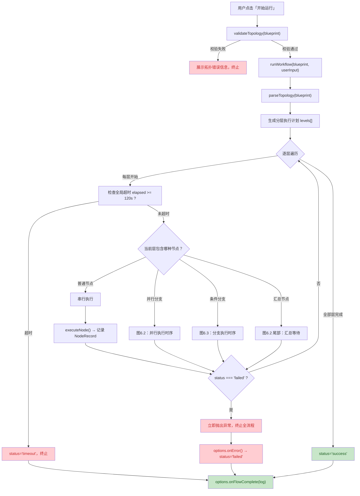

## 6.2 运行模式一：串行执行

**场景**：开始 → Agent1 → Agent2 → 结束

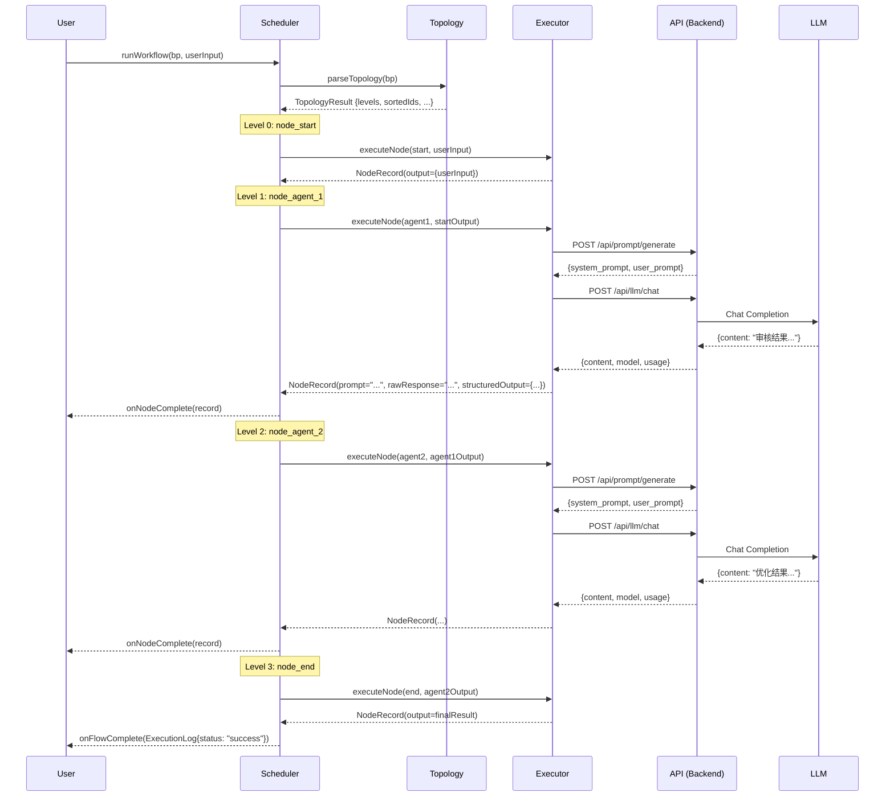

## 6.3 运行模式二：条件分支执行

**场景**：开始 → Agent → 条件分支（pass: AgentA / reject: AgentB）→ 结束

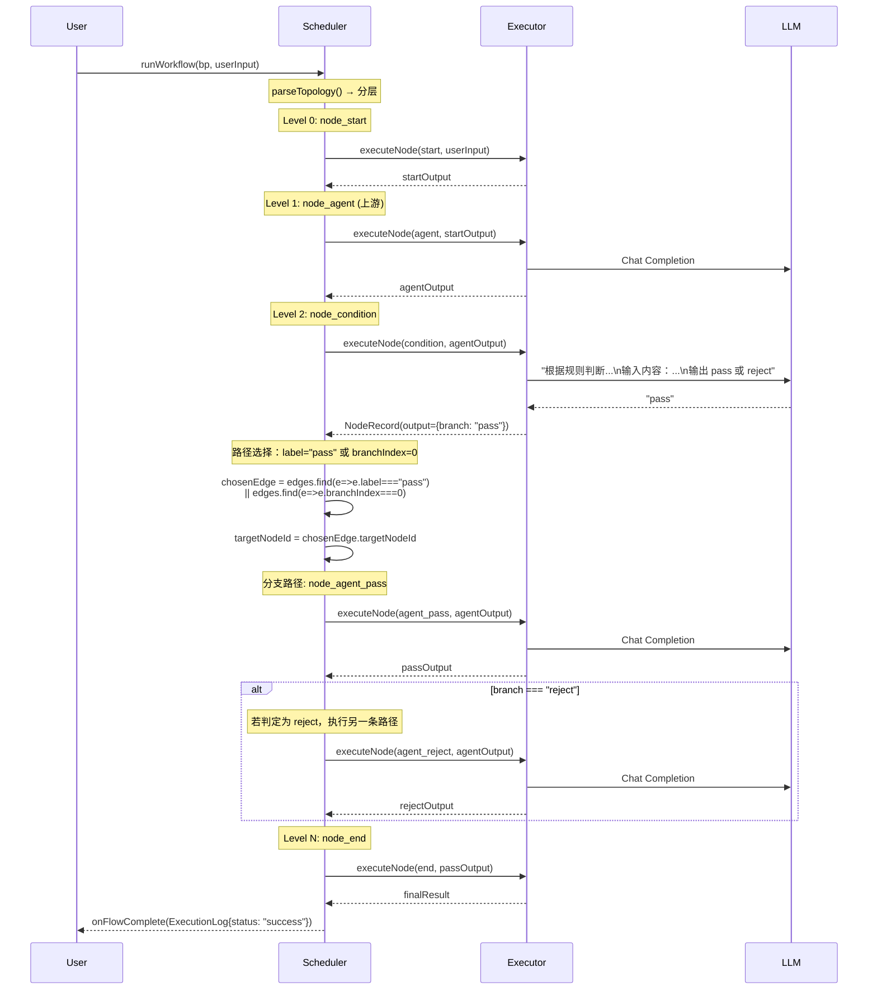

## 6.4 运行模式三：并行 + 汇总执行

**场景**：开始 → 并行分支 → [AgentA, AgentB, AgentC] → 汇总 → 结束

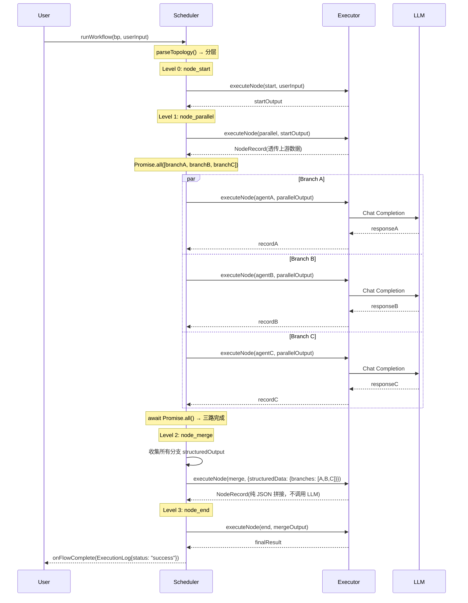

## 6.5 执行状态转换

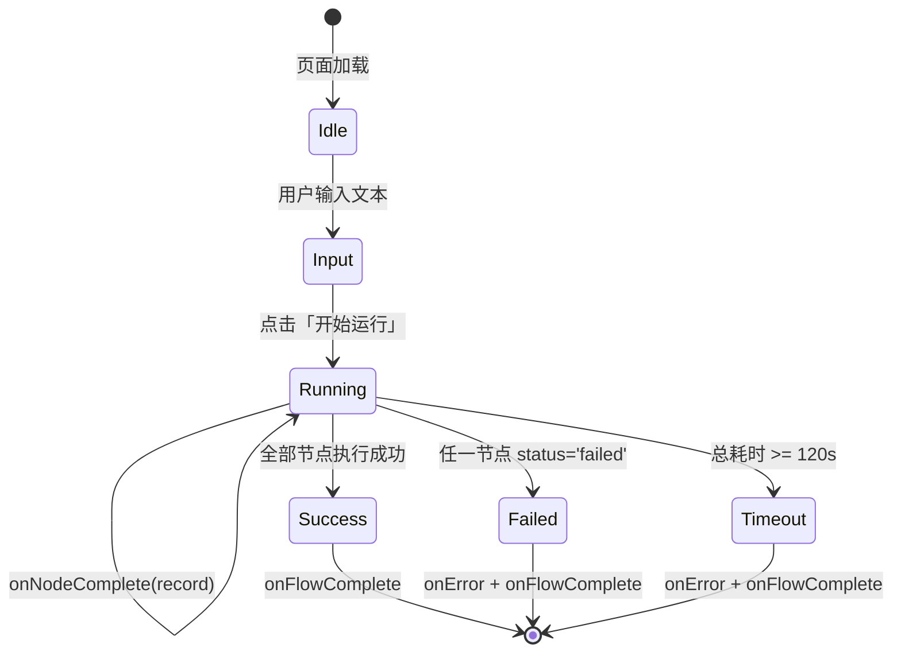

## 6.6 回调钩子接口

调度器通过 `SchedulerOptions` 暴露 4 个回调钩子，供 UI 层实现实时可视化：

```typescript
interface SchedulerOptions {
  onNodeStart?: (nodeId: string) => void;           // 节点开始执行
  onNodeComplete?: (record: NodeRecord) => void;    // 节点执行完成
  onFlowComplete?: (log: ExecutionLog) => void;     // 全流程完成
  onError?: (error: string) => void;                  // 异常终止
}
```

| 钩子 | 触发时机 | UI 层行为 |
|------|---------|---------|
| `onNodeStart` | executeNode 调用前 | 标记该节点为活跃状态（红色高亮） |
| `onNodeComplete` | executeNode 返回后 | 追加 NodeRecord 到卡片列表，节点恢复默认色 |
| `onFlowComplete` | runWorkflow 返回 | 展示完成摘要（总耗时、成功/失败节点数） |
| `onError` | 异常抛出 | 展示红色错误卡片，附带错误详情 |
# 7. 关键流程与算法

## 7.1 DAG 拓扑解析算法

### 7.1.1 环路检测（DFS 三色染色法）

**目的**：检测 DAG 中是否存在循环闭环，若存在则拒绝执行。

**算法描述**：

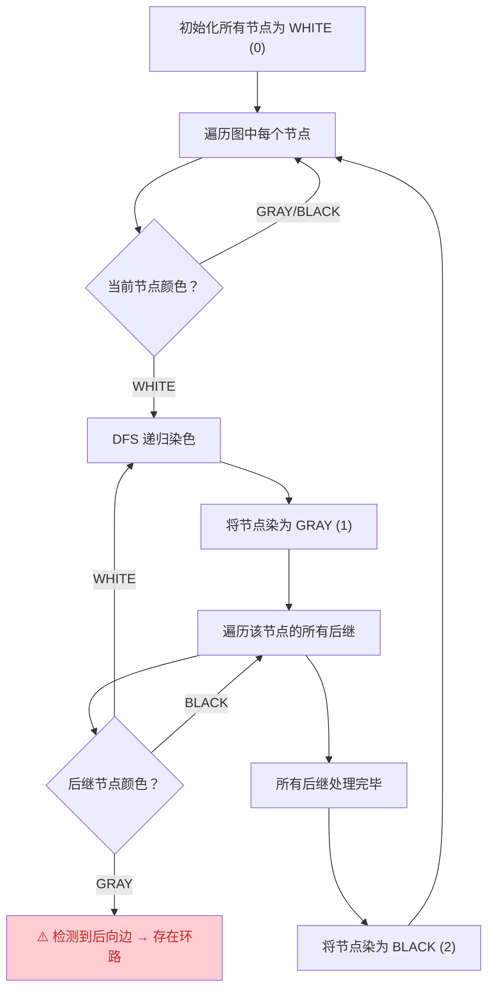

**时间复杂度**：O(V + E)，其中 V 为节点数，E 为边数。
**空间复杂度**：O(V)，颜色映射表的存储。

### 7.1.2 拓扑排序（Kahn BFS 算法）

**目的**：生成符合 DAG 依赖关系的线性执行顺序。

**算法步骤**：

1. 计算每个节点的入度（inDegree）
2. 将入度为 0 的节点（开始节点）加入处理队列
3. 从队列取出节点，加入排序结果
4. 遍历该节点的所有后继，将其入度减 1
5. 若后继入度变为 0，加入处理队列
6. 重复步骤 3-5 直到队列为空
7. 若排序结果长度 ≠ 总节点数，说明存在死循环（理论上已在环路检测阶段排除）

**时间复杂度**：O(V + E)
**空间复杂度**：O(V)

### 7.1.3 连通性校验（BFS 可达性分析）

**目的**：确保所有节点处于从开始节点到结束节点的连通路径中，防止悬挂节点。

**算法步骤**：

1. 从开始节点出发，BFS 遍历所有后继
2. 收集可达节点集合 `reachable`
3. 找出 `nodes` 中不在 `reachable` 中的节点
4. 若存在不可达节点，抛出错误提示用户删除或连接

**时间复杂度**：O(V + E)

### 7.1.4 分层生成（BFS Level）

**目的**：将拓扑排序结果按层级分组，为调度器提供分层执行依据。

**算法步骤**：

1. 开始节点 level = 0
2. BFS 遍历，当前节点 level + 1 赋给后继节点
3. 若后继已有更高级别，取最大值（处理多路径到达同一节点的情况）
4. 按 level 分组，生成 `TopologyLevel[]`

## 7.2 工作流调度策略

### 7.2.1 分层调度主循环

**算法：分层调度主循环（Level-Based Scheduler Main Loop）**

```
Input:  TopologyResult.topo（分层执行计划）,
        NodeMessage.initialMessage（用户初始输入）
Output: ExecutionLog（包含所有 NodeRecord）

Steps:
  1.  nodeResults ← { "user": initialMessage }
  2.  for each level in topo.levels:
  3.      if (Date.now() - globalStart >= 120_000):
  4.          throw Error("工作流执行超时")
  5.      remainingTime ← 120_000 - (Date.now() - globalStart)
  6.      if level contains "parallel" nodes:
  7.          call handleParallel(parallelNode, ...)
  8.      else if level contains "condition" nodes:
  9.          call handleCondition(condNode, ...)
 10.      else if level contains "merge" nodes:
 11.          call handleMerge(mergeNode, ...)
 12.      else:
 13.          for each nodeId in level.nodeIds:
 14.              record ← executeNode(node, input, remainingTime)
 15.              log.nodeRecords.push(record)
 16.              if record.status == "failed":
 17.                  throw Error("节点执行失败: " + record.error)
 18.  return log
```

### 7.2.2 并行分支处理策略

**算法：并行分支处理（Parallel Branch Handler）**

```
Input:  WorkflowNode.parallelNode（并行分支节点）,
        NodeMessage.input（上游输入）,
        TopologyResult.topo（拓扑结果）
Output: void（结果写入 log.nodeRecords 和 nodeResults）

Steps:
  1.  record ← executeNode(parallelNode, input, remainingTime)
  2.  log.nodeRecords.push(record)
  3.  nodeResults.set(parallelNode.nodeId, recordToMessage(record))
  4.  if record.status == "failed":
  5.      throw Error("并行分支节点执行失败")
  6.  branches ← topo.successors.get(parallelNode.nodeId)
  7.  branchPromises ← branches.map(branchStartId =>
  8.      executeBranch(branchStartId, topo, nodeResults, ...)
  9.  )
 10.  allBranchResults ← await Promise.all(branchPromises)
 11.  for each record in allBranchResults.flat():
 12.      log.nodeRecords.push(record)
 13.      if not nodeResults.has(record.nodeId):
 14.          nodeResults.set(record.nodeId, recordToMessage(record))
```

**关键设计**：
- `Promise.all` 实现真并发，所有分支的 LLM 调用同时发起
- 各分支内部通过 `executeBranch()` 递归处理嵌套的并行/条件节点
- 每分支继承剩余总时间的超时计时

### 7.2.3 条件分支路径选择策略

**算法：条件分支路径选择（Condition Branch Router）**

```
Input:  WorkflowNode.condNode（条件分支节点）,
        NodeMessage.input（上游输入）,
        WorkflowEdge[] edges（该节点的出边）
Output: string.targetNodeId（选中的下游节点 ID）

Steps:
  1.  condRecord ← executeNode(condNode, input, remainingTime)
  2.  decision ← condRecord.structuredOutput.branch           // "pass" | "reject"
  3.  targetBranchIndex ← (decision == "pass") ? 0 : 1
  4.  chosenEdge ←
  5.      edges.find(e ⇒ e.label == decision)                // 优先级1: label 精确匹配
  6.      || edges.find(e ⇒ e.branchIndex == targetBranchIndex)// 优先级2: branchIndex 匹配
  7.      || edges.find(e ⇒ e.label == undefined)             // 优先级3: 无 label 兜底
  8.  targetNodeId ← chosenEdge.targetNodeId || successors[0]
  9.  call executeBranch(targetNodeId, topo, nodeResults, ...)
```

**降级策略**：当 LLM 返回的 decision 无法匹配任何出边时，fallback 到 `successors[0]`。

## 7.3 Prompt 自动生成引擎

### 7.3.1 路由流程

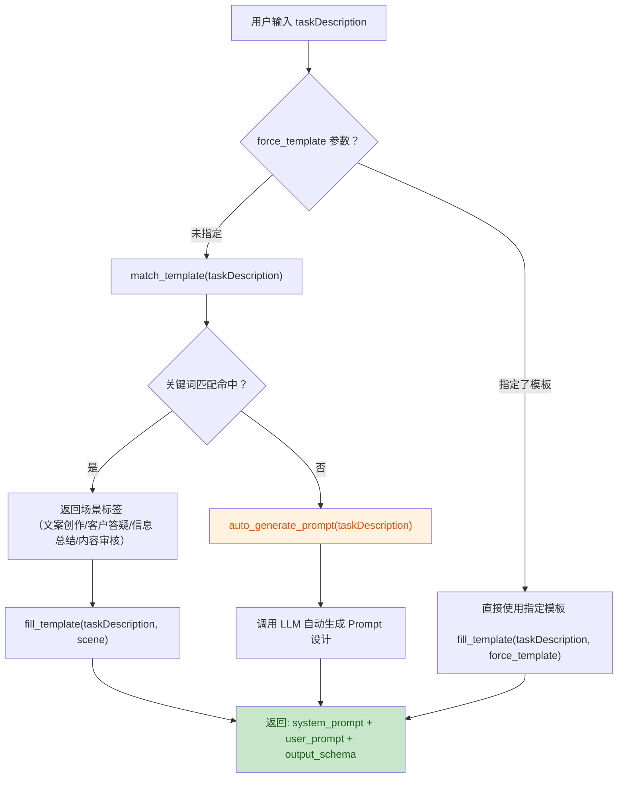

### 7.3.2 关键词匹配规则（MVP）

使用 Python 字符串 `in` 包含匹配（前端为正则包含），遍历 KEYWORD_TABLE：

```python
KEYWORD_TABLE = {
    "文案创作": ["写", "文案", "创作", "文章", "广告", "营销", "宣传"],
    "客户答疑": ["客户", "答疑", "问答", "客服", "回答", "咨询", "问题"],
    "信息总结": ["总结", "摘要", "概括", "归纳", "整理", "提炼"],
    "内容审核": ["审核", "审查", "检查", "合规", "敏感", "违规"],
}

def match_template(task_description: str) -> str | None:
    text = task_description.lower()
    for scene, keywords in KEYWORD_TABLE.items():
        for kw in keywords:
            if kw in text:
                return scene
    return None
```

**局限性**（已知，后续迭代升级）：
- 关键词精确包含匹配，不支持语义相似度
- 多场景命中时返回首个匹配（按字典遍历顺序）
- 后续可升级为 LLM 分类或向量相似度匹配

### 7.3.3 AI 自动生成 Prompt（无匹配时）

当关键词匹配未命中时，调用 LLM 作为 Prompt 设计师：

| 步骤 | 说明 |
|------|------|
| System Prompt | "你是一个专业的 AI Prompt 设计专家。用户会给出一个任务描述，你需要为其设计合适的 System Prompt 和 User Prompt..." |
| User Prompt | "请为以下任务设计 Prompt：\n{task_description}" |
| 输出约束 | 强制要求以 JSON 格式返回，包含 system_prompt / user_prompt / output_schema 三个字段 |
| 降级处理 | JSON 解析失败时返回通用 Prompt（"你是一个智能助手..."） |

## 7.4 主 Agent 工作流分析算法

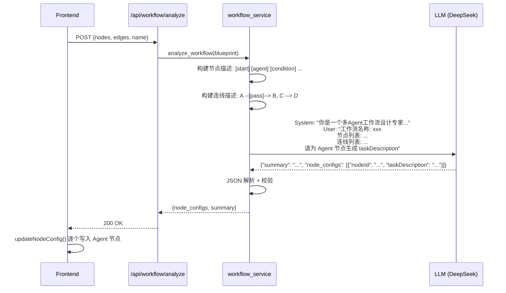

**关键设计**：
- 主 Agent 的输出格式与 `WorkflowNode.config.taskDescription` 结构一致，直接映射写入
- nodeId 全程保持完整，不截断不修改
- 解析失败时降级为简单提示（"请根据上游输入完成以下任务..."）

## 7.5 撤销栈管理算法

**算法：基于快照的撤销栈（Snapshot-Based Undo Stack）**

```
  Constants:
      MAX_UNDO_STEPS = 50

  Procedure addNode(nodeType, position):
  1.  pushUndo()                            // 先快照当前状态
  2.  nodes.push(newNode)

  Procedure pushUndo():
  1.  if undoStack.length >= MAX_UNDO_STEPS:
  2.      undoStack.shift()                 // 移除最旧快照
  3.  undoStack.push(JSON.stringify({ nodes, edges }))

  Procedure undo():
  1.  if undoStack.length == 0:
  2.      return                            // 无可撤销
  3.  snapshot ← undoStack.pop()
  4.  { nodes, edges } ← JSON.parse(snapshot)
```

**快照粒度**：
- 节点增删、连线增删、节点移动 → 每次操作前打快照
- 文本编辑（taskDescription / branchRule）→ 失焦或保存时打快照，非逐字符

---

# 8. 出错处理设计

## 8.1 异常分类模型

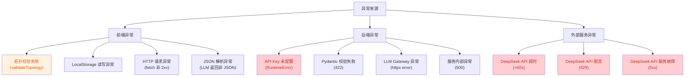

## 8.2 各层处理策略

### 8.2.1 前端异常处理

| 异常类型 | 检测位置 | 处理策略 | 用户可见行为 |
|---------|---------|---------|------------|
| 拓扑校验失败 | `validateTopology()` | 返回错误消息数组，阻塞保存/运行 | 顶部红色错误提示列出所有问题 |
| 环路检测 | `parseTopology()` DFS | 抛出 Error，被 `validateTopology` 捕获 | "检测到循环闭环，请检查节点连线" |
| 悬挂节点 | `parseTopology()` BFS | 抛出 Error，列出不可达节点 ID | "存在未连接的节点（从开始节点不可达）" |
| LLM 返回非 JSON | `executeAgent()` JSON.parse | catch 降级：用原始文本作为 result | 无报错，但 structuredOutput 为 `{result: "原始文本"}` |
| Prompt 生成失败 | `executeAgent()` catch | 降级：使用通用 systemPrompt + 原始 taskDesc | 功能正常运行，只是 Prompt 未定制 |
| 流程执行超时 | scheduler 每层检查 | 抛出 Error("超时")，status='timeout' | 红色超时提示 + 已执行节点日志 |
| 节点执行失败 | `executeNode()` | status='failed'，调度器立即终止全流程 | 红色错误卡片 + 完整日志 |
| LocalStorage 读写异常 | `JSON.parse` / `setItem` | 静默 catch，返回空数组/放弃写入 | 数据丢失风险（罕见） |

### 8.2.2 后端异常处理

| 异常类型 | HTTP 状态码 | 响应 detail | 触发条件 |
|---------|-----------|------------|---------|
| API Key 未配置 | 400 | "API Key 未配置，请先通过 POST /api/config/key 设置" | `load_api_key()` 返回 None |
| 模板不存在 | 400 | "未找到模板: {id}" | `force_template` 指定的模板不在 TEMPLATES 中 |
| Pydantic 校验失败 | 422 | FastAPI 自动生成 | 请求体不符合 Schema |
| LLM 调用超时 | 502 | "LLM 调用失败: {httpx.TimeoutException}" | httpx 请求超过 60s |
| LLM 返回异常 | 502 | "LLM 调用失败: {status_code}" | DeepSeek API 返回非 200 |
| Prompt 生成失败 | 502 | "Prompt 自动生成失败: {详情}" | AI 生成过程中异常 |
| 工作流分析失败 | 502 | "工作流分析失败: {详情}" | LLM 返回无法解析或报错 |
| 未知异常 | 500 | 默认错误消息 | 未捕获的服务内部异常 |

### 8.2.3 外部服务异常处理

| DeepSeek 异常 | 处理后 HTTP | 后续行为 |
|-------------|-----------|---------|
| 请求超时（>60s） | 502 | 工作流立即终止，节点标记 failed |
| 限流 429 | 502 | 同上，不自动重试 |
| 服务故障 5xx | 502 | 同上 |

## 8.3 日志记录规范

### 8.3.1 日志层级

| 层级 | 字段 | 记录时机 |
|------|------|---------|
| 全局 | ExecutionLog | `runWorkflow()` 返回时 |
| 节点 | NodeRecord[] | 每个 `executeNode()` 返回时 |

### 8.3.2 异常日志字段

当 `status: 'failed'` 时，额外记录：

| 字段 | 说明 |
|------|------|
| `ExecutionLog.errorMessage` | 整体失败原因（超时/节点失败/拓扑错误） |
| `NodeRecord.error` | 节点级错误详情（API 报错原文 / 超时提示） |

### 8.3.3 日志清除策略

- 不清除：日志持续累积在 LocalStorage
- 列表页仅展示最近 10 条
- 日志详情页通过 logId 查找任意历史日志

---

# 8.5 测试策略

## 8.5.1 测试分层

| 层级 | 范围 | 工具 | 覆盖重点 |
|------|------|------|---------|
| 单元测试 | 引擎模块（topology / scheduler / executor） | Vitest | 拓扑解析算法、调度器路径选择、执行器节点逻辑 |
| 单元测试 | 后端服务（llm_gateway / prompt_service / workflow_service） | pytest + httpx mock | API 调用封装、模板匹配、主 Agent 分析 |
| 集成测试 | 串行流程 | Playwright / 手动 | 开始→Agent→结束全链路 |
| 集成测试 | 分支流程 | Playwright / 手动 | 条件节点 pass/reject 分流验证 |
| 集成测试 | 并行+汇总流程 | Playwright / 手动 | Promise.all 并发 + JSON 拼接 |
| 端到端测试 | 完整用户旅程 | Playwright | 新建蓝图→拖拽节点→连线→运行→查看日志 |

## 8.5.2 关键测试用例

| 编号 | 测试场景 | 预期结果 |
|------|---------|---------|
| UT-01 | `parseTopology` 检测三节点环路 | 抛出 "检测到循环闭环" |
| UT-02 | `validateTopology` 校验 Agent 入边为 0 | 返回错误 "至少需要一条入边" |
| UT-03 | `validateTopology` 校验条件分支出边 ≠ 2 | 返回错误 "必须有恰好 2 条出边" |
| UT-04 | `executeCondition` 返回 "pass" | `structuredOutput.branch === "pass"` |
| UT-05 | `executeCondition` 返回 "reject" | `structuredOutput.branch === "reject"` |
| UT-06 | `executeAgent` JSON 解析失败 | 降级为 `{ result: "原始文本" }`，不抛异常 |
| UT-07 | `runWorkflow` 全局超时 | `log.status === "timeout"`，已执行节点有记录 |
| UT-08 | AbortController 触发 | fetch 请求被 AbortError 中断 |
| IT-01 | 开始→Agent→结束串行流程 | 输出结构化数据，日志完整 |
| IT-02 | 条件分支 pass 路径 | 仅 pass 分支 Agent 被执行 |
| IT-03 | 条件分支 reject 路径 | 仅 reject 分支 Agent 被执行 |
| IT-04 | 并行 3 路→汇总 | 3 路并发执行，汇总节点输出包含 3 个分支结果 |
| E2E-01 | 用户完整流程：新建→编辑→运行 | 蓝图保存、执行成功、日志可查看 |

## 8.5.3 测试环境

| 环境 | 配置 |
|------|------|
| 浏览器 | Chrome 最新版、Edge 最新版 |
| Node.js | ≥ 18 |
| Python | ≥ 3.11 |
| LLM Mock | 使用 mock server 模拟 DeepSeek API 响应，避免测试消耗 token |

---

# 9. 安全设计

## 9.1 API Key 安全方案

### 9.1.1 整体架构

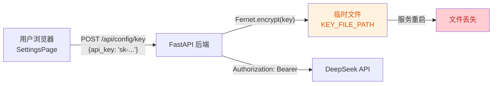

### 9.1.2 加密方案

| 属性 | 值 |
|------|-----|
| 算法 | Fernet（AES-128-CBC + HMAC-SHA256） |
| 密钥 | 预生成固定值，硬编码于 `key_manager.py` |
| 存储位置 | `KEY_FILE_PATH`（`backend/.key_store.enc`） |
| 生命周期 | 服务重启后文件自动保留但路径固定；MVP 阶段重启即"丢失"指用户需重新输入 |

### 9.1.3 安全边界

| 安全措施 | 说明 |
|---------|------|
| Key 不落前端 | 前端不存储任何 Key 信息，所有 LLM 调用经后端转发 |
| 传输加密 | HTTPS（生产环境），MVP 阶段 HTTP localhost 可接受 |
| 加密存储 | Fernet 密文写入临时文件，非明文 |
| 无日志泄露 | Key 不出现在任何 NodeRecord.prompt 或日志中 |
| CORS 限制 | `allow_origins=["*"]`（MVP），生产需限制为前端域名 |
| 限流防护 | 未实现（MVP），后续可加入请求频率限制 |

### 9.1.4 已知风险与缓解

| 风险 | 等级 | 缓解措施 | 后续计划 |
|------|------|---------|---------|
| Fernet 密钥硬编码于源码 | 中 | MVP 阶段可接受（单机部署） | 生产环境改用环境变量注入 |
| CORS allow_origins=["*"] | 中 | MVP localhost 无实际风险 | 生产限制为前端域名 |
| API Key 临时文件可读 | 低 | Fernet 加密后无法直接使用 | 后续加文件权限控制 |
| 无请求频率限制 | 低 | MVP 无公开暴露 | 后续加入 rate-limit |

## 9.2 输入校验

### 9.2.1 前端校验

| 校验点 | 位置 | 规则 |
|--------|------|------|
| 拓扑约束 | `validateTopology()` | 6 种节点出入度规则 + 环路 + 连通性 |
| 开始节点唯一性 | `parseTopology()` | `startNodes.length === 1` |
| 结束节点存在性 | `parseTopology()` | `endNodes.length >= 1` |
| 用户输入非空 | `ExecutePage.handleStart()` | `userInput.trim() !== ""` |
| API Key 非空 | `SettingsPage.handleSet()` | `apiKey.trim() !== ""` |
| 蓝图名称非空 | 允许为空，默认"未命名工作流" | — |

### 9.2.2 后端校验

| 校验点 | 位置 | 规则 |
|--------|------|------|
| 请求体结构 | Pydantic model | 类型 + 必填校验 |
| temperature 范围 | `LLMChatRequest` | [0, 2.0] |
| max_tokens 范围 | `LLMChatRequest` | [1, 32768] |
| API Key 存在性 | `call_llm()` | 运行时校验，无 Key 抛 RuntimeError |

## 9.3 XSS 防护

| 措施 | 说明 |
|------|------|
| React 默认转义 | JSX 中 `{}` 插值自动转义 HTML 实体 |
| 无 innerHTML | 所有渲染通过 React Virtual DOM，不直接操作 DOM |
| JSON.parse 安全 | 解析 LLM 返回的 JSON 失败时降级为字符串，不执行代码 |

---

# 10. 约束与限制

## 10.1 MVP 硬约束

| 约束项 | 值/说明 |
|--------|---------|
| 节点能力 | 仅文本对话 Agent，无工具调用/知识库检索/API 调用 |
| 编程模式 | 纯零代码，用户仅填写自然语言描述，不支持脚本输入 |
| 存储方式 | 浏览器 LocalStorage 存储蓝图与日志，无云端同步，无账号系统 |
| LLM 调用 | 单轮调用，Agent 节点内部无多轮自我反思（预留开关） |
| 执行时限 | 全局 120 秒，超时自动强制终止 |
| 重试机制 | 无自动重试，失败即终止 |
| 撤销粒度 | 仅撤回（Undo），无重做（Redo）；最多 50 步快照 |
| 版本管理 | 无 |
| 并行分支 | 最大 10 条子链路（后端配置可控），MVP 阶段未硬限制 |
| 嵌套汇总 | 不支持，`executeBranch()` 中子路径 merge 节点跳过 |
| 浏览器兼容 | Chrome、Edge 桌面版 |
| LLM 供应商 | 仅支持 DeepSeek（页面供应商选择预留了扩展 UI，但后端仅对接 DeepSeek） |

## 10.2 性能约束

| 约束项 | 值/说明 |
|--------|---------|
| 单节点 LLM 调用超时 | 60 秒（`LLM_TIMEOUT`） |
| 单次 Prompt 生成超时 | 受 LLM 调用超时间接限制 |
| 画布最大节点数 | 无硬限制，受 LocalStorage 容量（通常 5-10MB）和浏览器性能约束 |
| 日志数量 | 无硬限制，受 LocalStorage 容量约束 |

### 10.2.1 性能基准预期

| 指标 | 预期值 | 测量条件 |
|------|--------|---------|
| 单节点 LLM 调用平均延迟 | ~3-8s | 受 DeepSeek API 响应时间和网络延迟影响 |
| 条件分支 LLM 判断延迟 | ~2-5s | temperature=0.1，单 token 输出 |
| 画布在 50 节点下的渲染帧率 | ≥30fps | X6 v2 SVG 渲染，Chrome 桌面版 |
| 画布在 100 节点下的渲染帧率 | ≥20fps | 同上 |
| 蓝图保存/读取延迟 | <50ms | LocalStorage JSON 序列化/反序列化 |
| LocalStorage 建议存储上限 | ≤5MB | 约 200 个中等规模蓝图（每个 ~25KB） |
| 全局工作流超时 | 120s | 从 runWorkflow 调用开始计时 |

## 10.3 平台约束

| 约束项 | 说明 |
|--------|------|
| 前端运行 | Node.js ≥ 18，npm 安装依赖后通过 Vite dev server 运行 |
| 后端运行 | Python ≥ 3.11，通过 conda 管理虚拟环境，uvicorn 启动 |
| 网络要求 | 后端需访问 `https://api.deepseek.com` |
| 认证要求 | 用户需自行获取 DeepSeek API Key |

## 10.4 已知技术债务（后续迭代）

| 债务项 | 当前状态 | 后续计划 |
|--------|---------|---------|
| Fernet 密钥硬编码 | `key_manager.py` 中固定值 | 改环境变量注入 |
| 无身份认证 | 任何用户可访问 API | 加入 API Token 认证 |
| 无请求频率限制 | 可能被滥用 | 加入 rate-limit |
| CORS 全开 | `allow_origins=["*"]` | 限制为目标前端域名 |
| Prompt 关键词匹配简陋 | 仅字符串 `in` 包含 | 升级为语义匹配或 LLM 分类器 |
| 汇总无 AI 合并 | 纯 JSON 拼接 | 加入 AI 合并开关 |
| 嵌套汇总不支持 | `executeBranch` 中跳过 | 实现递归汇总 |
| X6 v2 API 兼容 | `bindKey` 已移除，已改用 DOM keydown | 持续跟踪 X6 版本升级 |
| 条件分支仅 label 匹配 | 已修复为 label → branchIndex → undefined 三级回退 | 持续观察 |
| AbortController 信号传递 | 已修复传递至 fetch | 持续观察 |

---

# 附录 A：数据模型参考表

## A.1 蓝图相关

| 实体 | 字段 | 类型 | 必填 | 说明 |
|------|------|------|------|------|
| WorkflowBlueprint | id | string | 是 | 蓝图唯一标识，格式 `bp_{timestamp}` |
| | name | string | 是 | 用户命名，默认 "未命名工作流" |
| | createTime | number | 是 | Unix 毫秒时间戳 |
| | nodes | WorkflowNode[] | 是 | 节点列表 |
| | edges | WorkflowEdge[] | 是 | 连线列表 |
| WorkflowNode | nodeId | string | 是 | 格式 `node_{timestamp}_{counter}` |
| | nodeType | NodeType | 是 | 枚举：start/agent/condition/parallel/merge/end |
| | position | {x: number, y: number} | 是 | 画布像素坐标 |
| | config | NodeConfig | 是 | 节点配置对象 |
| NodeConfig | taskDescription | string? | 否 | Agent 节点任务描述 |
| | branchRule | string? | 否 | 条件分支判断规则 |
| | templateId | string? | 否 | 匹配到的 Prompt 模板 ID |
| WorkflowEdge | edgeId | string | 是 | 格式 `edge_{timestamp}_{counter}` |
| | sourceNodeId | string | 是 | 源节点 ID |
| | targetNodeId | string | 是 | 目标节点 ID |
| | label | string? | 否 | 分支标识（"pass"/"reject"） |
| | branchIndex | number? | 否 | 分支数字索引，与 label 二选一 |
| NodeMessage | sourceNodeId | string | 是 | 发送方节点 ID |
| | rawContent | string | 是 | 原始文本 |
| | structuredData | object | 是 | 结构化 JSON |
| | timestamp | number | 是 | Unix 毫秒时间戳 |

## A.2 执行日志相关

| 实体 | 字段 | 类型 | 必填 | 说明 |
|------|------|------|------|------|
| ExecutionLog | logId | string | 是 | 格式 `log_{timestamp}` |
| | blueprintId | string | 是 | 关联蓝图 ID |
| | startTime | number | 是 | 整体开始时间戳 |
| | endTime | number | 是 | 整体结束时间戳 |
| | status | "success"/"failed"/"timeout" | 是 | 执行结果 |
| | errorMessage | string? | 否 | 整体失败原因 |
| | nodeRecords | NodeRecord[] | 是 | 各节点记录 |
| NodeRecord | nodeId | string | 是 | 节点 ID |
| | nodeType | string | 是 | 节点类型 |
| | input | any | 是 | 入参 JSON |
| | prompt | string? | 否 | 发送给 LLM 的 Prompt |
| | rawResponse | string? | 否 | LLM 原始返回 |
| | structuredOutput | any? | 否 | 处理后结构化输出 |
| | startTime | number | 是 | 节点开始时间 |
| | endTime | number | 是 | 节点结束时间 |
| | durationMs | number | 是 | 节点耗时（毫秒） |
| | status | "pending"/"running"/"success"/"failed" | 是 | 节点状态 |
| | error | string? | 否 | 节点错误信息 |

## A.3 REST API 汇总

| 方法 | 路径 | 请求体 | 响应体 | 错误码 |
|------|------|--------|--------|--------|
| GET | /api/health | — | `{status, env}` | — |
| POST | /api/config/key | `{api_key}` | `{success, message, data}` | — |
| GET | /api/config/key | — | `{configured, message}` | — |
| DELETE | /api/config/key | — | `{success, message, data}` | — |
| POST | /api/llm/chat | `{messages, temperature?, max_tokens?}` | `{content, model, usage}` | 400, 502 |
| POST | /api/prompt/generate | `{task_description, force_template?}` | `{system_prompt, user_prompt, template_id, output_schema}` | 400, 502 |
| POST | /api/workflow/analyze | `{id, name?, nodes, edges}` | `{node_configs, summary}` | 400, 502 |

---

# 附录 B：环境搭建指南

## B.1 环境要求

| 组件 | 最低版本 | 推荐版本 | 验证命令 |
|------|---------|---------|---------|
| Node.js | 18.0.0 | 20.x LTS | `node --version` |
| npm | 9.0.0 | 10.x | `npm --version` |
| Python | 3.11.0 | 3.11.x | `python --version` |
| Conda | 23.0.0 | 最新版本 | `conda --version` |

## B.2 后端搭建

```powershell
# 1. 创建并激活 conda 虚拟环境
conda create -n masm python=3.11 -y
conda activate masm

# 2. 安装 Python 依赖
cd backend
pip install -r requirements.txt

# 3. 启动开发服务器（默认 http://127.0.0.1:8000）
python -m uvicorn app.main:app --host 127.0.0.1 --port 8000 --reload

# 4. 验证：访问 http://127.0.0.1:8000/docs 查看 Swagger 文档
```

## B.3 前端搭建

```powershell
# 1. 安装 Node.js 依赖
cd frontend
npm install

# 2. 启动开发服务器（默认 http://localhost:5173）
npm run dev

# 3. 生产构建
npm run build
npm run preview
```

## B.4 首次使用流程

1. 启动后端（步骤 B.2）
2. 启动前端（步骤 B.3）
3. 打开浏览器访问 `http://localhost:5173`
4. 点击首页 **⚙ 设置** → 输入 DeepSeek API Key → 保存
5. 点击 **+ 新建蓝图** → 开始拖拽节点搭建工作流

---

# 附录 C：关键配置项列表

| 配置项 | 文件位置 | 默认值 | 说明 |
|--------|---------|--------|------|
| TOTAL_TIMEOUT_MS | `engine/scheduler.ts` | 120000 | 全局工作流执行上限（毫秒） |
| LLM_TIMEOUT | `services/llm_gateway.py` | 60 | 单次 LLM 调用超时（秒） |
| DEFAULT_NODE_TIMEOUT | `engine/executor.ts` | 60000 | 单节点默认超时（毫秒） |
| MAX_UNDO_STEPS | `store/blueprintStore.ts` | 50 | 撤销栈上限（步） |
| DEEPSEEK_BASE_URL | `services/llm_gateway.py` | `https://api.deepseek.com/v1` | LLM API 地址 |
| DEEPSEEK_CHAT_MODEL | `services/llm_gateway.py` | `deepseek-chat` | 默认模型名称 |
| KEY_FILE_PATH | `core/config.py` | `backend/.key_store.enc` | API Key 加密存储路径 |
| APP_HOST | `core/config.py` | 127.0.0.1 | 后端监听地址 |
| APP_PORT | `core/config.py` | 8000 | 后端监听端口 |
| API_BASE | `services/api.ts` | "" | 前端 API 前缀（Vite proxy 自动转发） |

---

> **文档结束。**